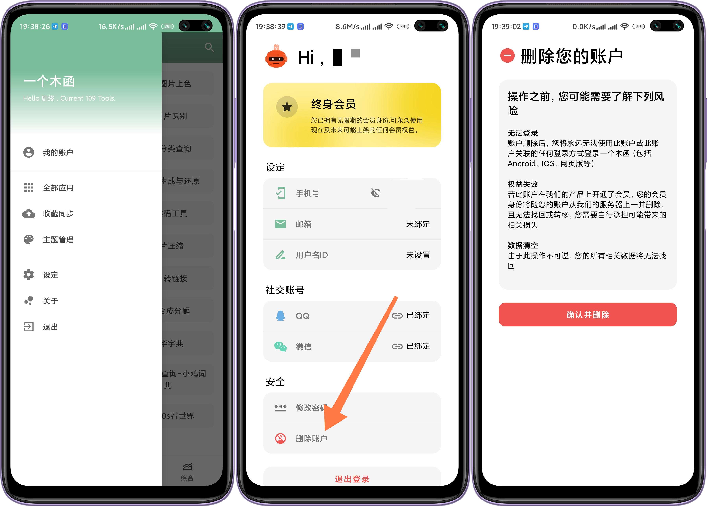
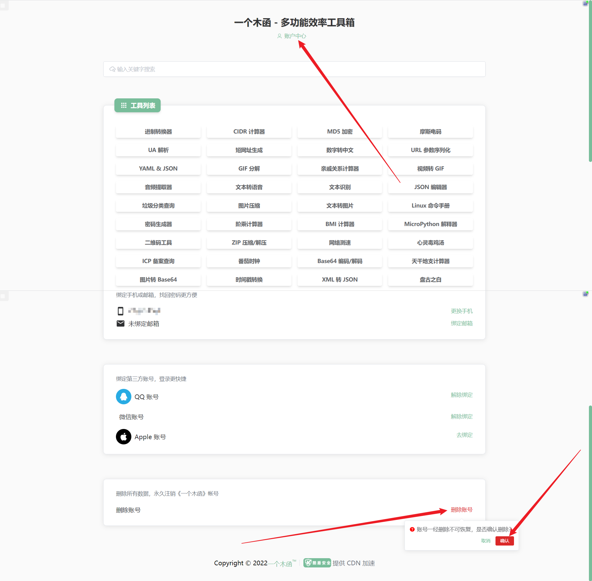
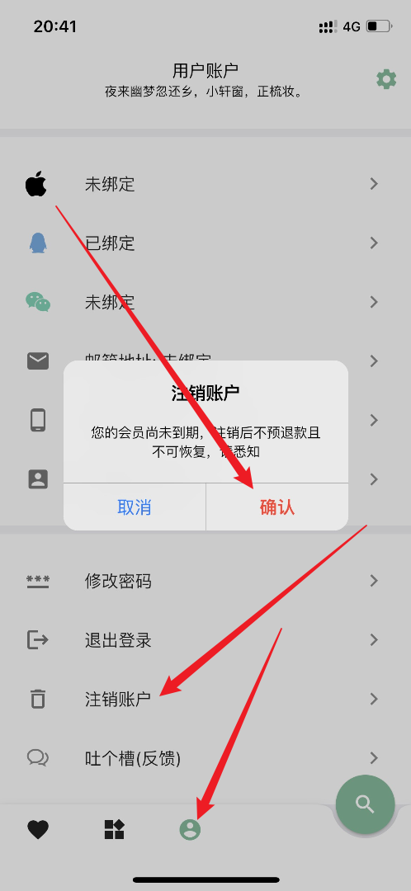

# 账号注销(删除)

操作之前，您可能需要了解下列风险

## 无法登录
账户删除后，您将永远无法使用此账户或此账户关联的任何登录方式登录一个木函（包括Android、IOS、网页版等）。

## 权益失效
若此账户在我们的产品上开通了会员，您的会员身份将随您的账户从我们的服务器上一并删除，且无法找回或转移，您需要自行承担可能带来的相关损失。

## 数据清空
由于此操作不可逆，您的所有相关数据将无法找回。

## 操作路径
如果您阅读后确认仍要注销，可继续阅读查看不同平台的注销路径。

### Android客户端
Android客户端-左上角三条横线-我的账户-删除账户-等待5秒后确认删除。

### 网页版
网页版首页-我的账户-删除账户-确认即可

### iOS客户端
iOS客户端首页-下方第三个人像图标-删除账户-确认即可

